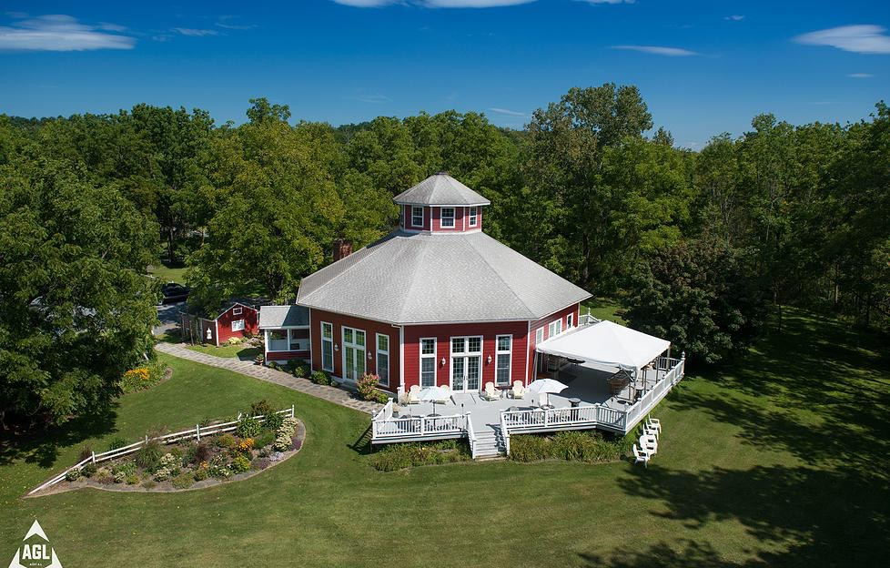

# The Appel Inn at the Gathering Space

Our wedding venue is located at 590 Route 146 Altamont, New York 12009, just outside of Albany.

Accommodations for the Appel Inn are being handled by the following hotels. We will be providing shuttles that will go from the hotel to the venue and back in the evening. Ask your hotel receptionist about the wedding block to receive the welcome bag!

### Details

#### Events

October 7th, 2018 at the Appel Inn

* Ceremony at 5:00pm
* Reception at 5:30pm
* Ends at 11:00pm

#### Buses for Hotels

* Pick up at 4:15pm
* One pickup at beginning of wedding
* One dropoff at end of wedding

#### Special Rates

* The wedding block is available until September 7th, book soon!
* Ask for the Trivigno/Taverna wedding block

#### Baby Sitters

Baby sitters will be available at the hotels, please reach out to Alyssa for availability

### Hampton Inn Albany Western Ave University Area
You can contact the hotel at (518) 438-0001. For more details or to book online [click here](http://www.albanywesternaveuniversityarea.hamptoninn.com/).

 
Expand Pricing Details

| Room | Rate |
| ------------- | ------------- |
| Two Queens Studio  | $134.00  |
| One King One Sofa Bed  | $134.00  |
| One King Bed  | $134.00  |
| One King Parlor Suite  | $154.00  |

 

### Staybridge Suites Wolf Road
You can contact the hotel at (518) 438-3300. For more details or to book online [click here](http://www.ihg.com/staybridge/hotels/us/en/albany/albee/hoteldetail?cm_mmc=GoogleMaps-_-sb-_-USEN-_-albee).

 
Expand Pricing Details

| Room | Rate |
| ------------- | ------------- |
| King One Bedroom  | $154.00  |
| King Studio  | $154.00  |
| Two Queens One Bedroom  | $164.00  |
| Two Queens Studio  | $164.00  |

 

### Homewood Suites Wolf Road
You can contact the hotel at (518) 438-4300. For more details or to book online [click here](http://homewoodsuites3.hilton.com/en/hotels/new-york/homewood-suites-by-hilton-albany-ALBHWHW/index.html).

 
Expand Pricing Details

| Room | Rate |
| ------------- | ------------- |
| King One Bedroom  | $144.00  |
| King Studio  | $144.00  |
| Two Queens One Bedroom  | $154.00  |
| Two Queens Studio  | $154.00  |

 

----

For more information on the venue, [click here to visit their site](https://www.appelinn.com/weddings-events).

<iframe src="https://www.google.com/maps/embed?pb=!1m18!1m12!1m3!1d2931.716754691895!2d-73.98767304849005!3d42.7097179208375!2m3!1f0!2f0!3f0!3m2!1i1024!2i768!4f13.1!3m3!1m2!1s0x89de771dae5e3ae7%3A0x3a61e56fdfb31fc5!2sAppel+Inn!5e0!3m2!1sen!2sus!4v1509999823604" width="600" height="450" frameborder="0" allowfullscreen></iframe>

### What to do after?

The following are recommendations for what to do around Albany while you are up here!

#### Easy walking trails, scenic outlooks
* [Thatcher State Park](https://parks.ny.gov/parks/128/details.aspx)

#### Hiking trails
* [Pine Bush Preserve](http://www.albanypinebush.org/)
* [Plotter Kill Preserve]()

#### Apple Picking & Cider Donuts
* [Indian Ladder Farms](http://www.indianladderfarms.com/)

#### Breweries
* [Druthers Brewery](http://www.druthersbrewing.com/) (Delicious Food)
* [Fort Orange Brewery](https://www.fortorangebrewing.com/)
* [Nine Pin Cider Works](http://www.ninepincider.com/)

#### Ice Cream
* [Guptill's ice cream](https://www.google.com/maps/dir//guptill's+ice+cream/data=!4m6!4m5!1m1!4e2!1m2!1m1!1s0x89de11fecda8e99b:0xd32c63bfefff869e?sa=X&ved=2ahUKEwjSz6fT9uPdAhXRct8KHbN1AqoQ9RcwC3oECAoQEw)

#### Best Brunch
* [Cafe Madison](http://www.cafemadisonalbany.com/)

#### Best Dinner
* [New World Bistro Bar](http://newworldbistrobar.com/)
* [Mezzanotte](http://www.mezzanottealbany.com/)
